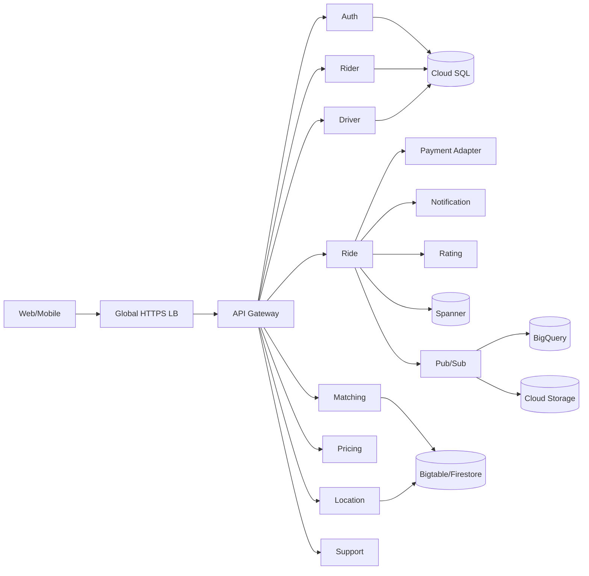
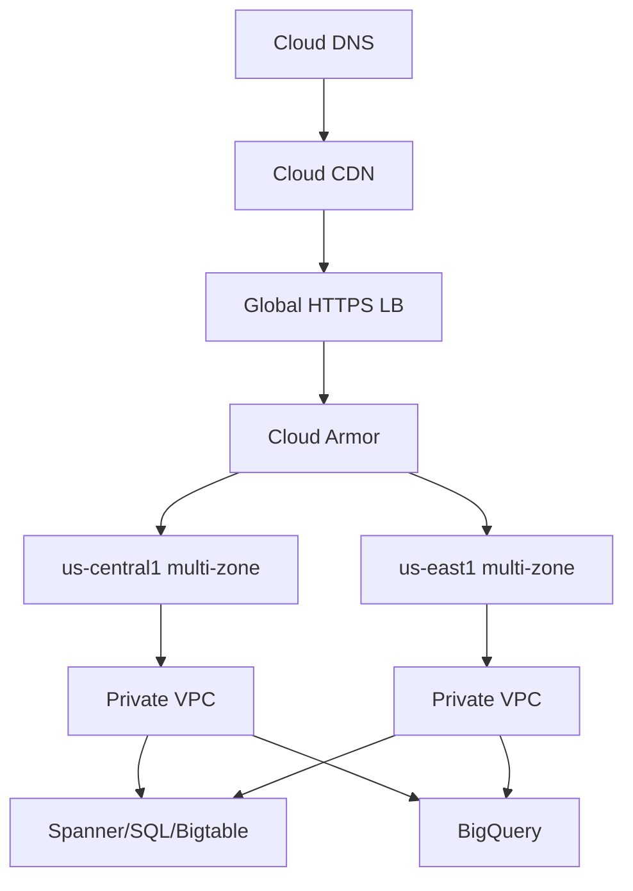
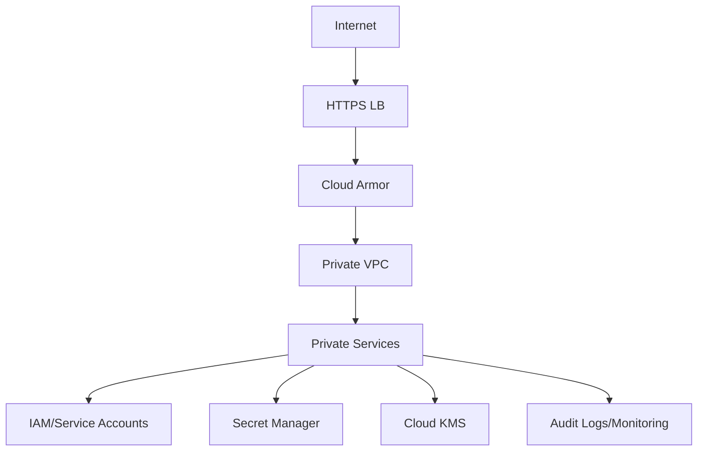

# RideNow — Google Cloud Architect Workbook

## 1. Case study
RideNow is a cloud-native ride-sharing platform supporting rider/driver registration, availability, ride requests, matching, fare estimation, location updates, trip tracking, ratings, notifications, support and analytics.

**Roles:** Rider, Driver, Operations/Admin, Support Agent.

## 2. Personas and stories
**Amara (Rider):** wants dependable pickup, transparent fares and live trip status.

**Daniel (Driver):** wants efficient nearby matching, availability control and clear earnings.

Stories: (1) rider requests a pickup/destination; (2) driver receives and accepts a suitable request; (3) rider tracks an active trip and ETA.

## 3. SLI/SLO
| Service | Availability | Target |
|---|---:|---|
| Web/Mobile UI | 99.95% | P95 <300ms |
| Auth | 99.99% | P95 <250ms |
| Rider/Driver | 99.95% | P95 <300ms |
| Ride | 99.95% | P95 <500ms |
| Matching | 99.90% | P95 <1s |
| Location | 99.90% | P95 <500ms |
| Pricing | 99.95% | P95 <300ms |
| Analytics | 99.50% | batch <15min |
| Customer/Ride DB | 99.99% | P95 <150ms |
| Warehouse | 99.50% | query <10s |

## 4. Microservices

## 5. REST API
`POST /auth/login|refresh`; `GET/POST/PATCH /riders`; `GET/POST/PATCH /drivers`; `GET/POST/PATCH /rides`; `GET/POST /matches`; `POST /fares/estimate`; `GET/POST /locations`; `GET/POST /payments`; `GET/POST /rides/{id}/rating`; `GET/POST /notifications`; `GET/POST/PATCH /tickets`; `POST /events`.

## 6. Storage
Identity/rider/driver/rides/ratings use structured SQL with strong consistency. Matching and location use NoSQL with eventual/near-real-time consistency and high write rates. Analytics uses a warehouse with TB-PB analytical volume. Backups and media use object storage.

## 7. GCP services
Persistent Disk for attached block storage; Cloud Storage for backups/assets; Cloud SQL for relational operations; Firestore for flexible documents; Bigtable for high-volume location telemetry; Spanner for globally consistent ride transactions; BigQuery for analytics/reporting.

## 8. Network and load balancing
Internet-facing HTTPS enters through a global external HTTPS Application Load Balancer protected by Cloud Armor. Private services use a custom VPC and internal load balancing. TCP/HTTPS is the primary transport. Multi-region: `us-central1` + `us-east1`.

## 9. Network diagram

## 10. Reliability/scalability
Multi-zone services, health checks, autoscaling, global routing, Pub/Sub asynchronous events, Spanner multi-region replication, replicated Bigtable clusters, CDN caching and centralized monitoring.

## 11. Disaster recovery
Primary `us-central1`, secondary `us-east1`. Global traffic shifts on regional health failure. **Ride DB:** near-zero RPO/5-min RTO/Critical. **Location:** 5-min/15-min/High. **Auth:** 5-min/10-min/Critical. **Ratings:** 24-hr/1-hr/Medium. **Analytics:** 24-hr/4-hr/Medium. Cloud SQL uses automated backup + PITR; Spanner and Bigtable use replication; Storage holds backup exports; Artifact Registry/source/IaC enable redeployment.

## 12. Security

Least privilege, private databases, TLS, restricted egress, firewall segmentation, secrets management, optional CMEK, logging, vulnerability scanning and alerting. Never commit credentials.

## 13. Cost planning
| Group | USD/month estimate |
|---|---:|
| Compute | 500–1,200 |
| Spanner/Cloud SQL | 600–1,500 |
| Bigtable | 500–1,200 |
| BigQuery | 150–500 |
| Network/CDN | 300–900 |
| Security/observability | 200–600 |
| Storage/backups | 50–200 |
| **Total planning range** | **2,300–6,100** |

Planning estimate only; validate production assumptions with the current Google Cloud Pricing Calculator.
